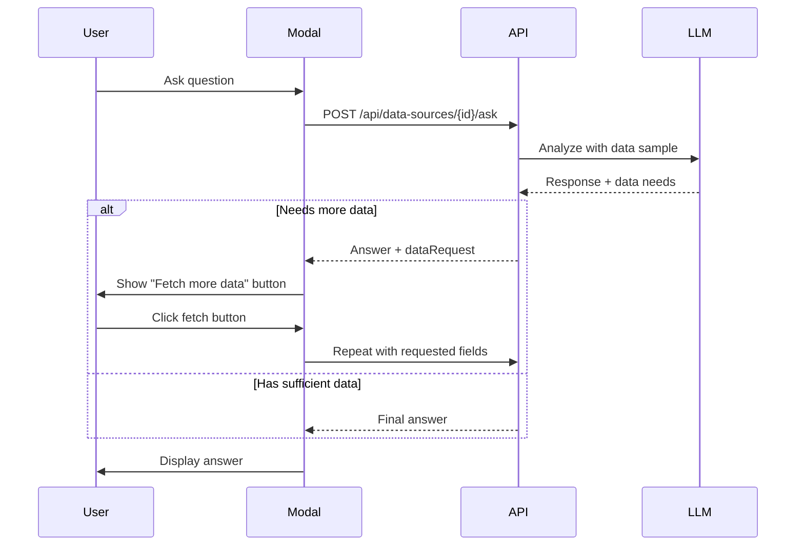

# Developer Guide - AI-Powered Metadata System

## Overview
The AI-Powered Metadata System enhances data discovery with intelligent summaries and interactive Q&A capabilities. This guide covers the technical implementation details for developers working with or extending these features.

## Architecture

### Database Schema
The system adds AI metadata fields to the `data_sources` table via migration 053:

```sql
-- AI summary fields
ai_summary TEXT
user_summary TEXT
summary_generated_at TIMESTAMP
summary_updated_at TIMESTAMP
summary_version INTEGER DEFAULT 1

-- Metadata field for future extensibility
metadata JSONB
```

### Component Structure

```
src/
├── app/api/data-sources/
│   ├── [id]/
│   │   ├── summary/route.ts    # AI summary generation & updates
│   │   └── ask/route.ts        # AI Q&A endpoint
├── components/dataSourceTable/
│   ├── DataSourceSummary.tsx   # Summary display & editing UI
│   └── AskAIModal.tsx          # Interactive Q&A modal
└── services/
    └── llmService.ts           # LLM integration service
```

## AI Summary System

### Summary Generation Flow
1. User clicks "Generate AI Summary" button
2. Frontend calls `POST /api/data-sources/{id}/summary` with `action: 'generate'`
3. API extracts sample data and schema from transformed data
4. LLM analyzes structure and content to generate business-friendly summary
5. Summary stored in database with timestamp and version

### Summary Management
- **AI Summary**: Auto-generated description of data content and structure
- **User Summary**: Manual override that takes precedence when displayed
- **Version Tracking**: Increments on each update for audit trail
- **Dual Display**: Shows AI-generated label when AI summary is active

### Code Example - Summary Generation
```typescript
// API Route Handler
const prompt = `Analyze this data source and provide a concise summary...
Name: ${dataSource.name}
Type: ${dataSource.type}
Sample Data: ${sampleData}
Schema: ${dataStructure}`;

const summary = await llmService.analyze({
  prompt,
  maxTokens: 200,
  temperature: 0.3
});

// Update database
await repository.update(id, {
  aiSummary: summary.content,
  summaryGeneratedAt: new Date(),
  summaryVersion: (dataSource.summaryVersion || 0) + 1
});
```

## AI Q&A System

### Intelligent Question Answering
The Q&A system provides context-aware answers with automatic data fetching when needed.

### Key Features

#### 1. Conversation Context
- Maintains chat history within browser session using sessionStorage
- Passes conversation history to API for context-aware responses
- Allows natural follow-up questions

#### 2. Smart Data Fetching
The system automatically detects when more data is needed:

```typescript
// Detection patterns in prompts
if (question.includes('how many unique') || 
    question.includes('average') ||
    question.includes('distribution')) {
  // Request specific fields with appropriate record limits
}
```

#### 3. Server-Side Statistics
For large datasets, statistics are calculated server-side:

```typescript
// Numeric field statistics
stats[field] = {
  count: numbers.length,
  sum: sum,
  average: sum / numbers.length,
  min: Math.min(...numbers),
  max: Math.max(...numbers)
};

// Categorical field distribution
stats[field] = {
  uniqueValues: uniqueCount,
  distribution: valueCounts.map(([value, count]) => ({
    value,
    count,
    percentage: ((count / total) * 100).toFixed(2) + '%'
  }))
};
```

#### 4. Data Size Management
- Categorical data limited to ~50KB to prevent memory issues
- Shows sample values with counts when data is too large
- Provides clear error messages for oversized data

### Q&A Response Flow



### Code Example - Q&A Implementation
```typescript
// Frontend - Handling data requests
const handleFetchMoreData = async (dataRequest) => {
  const response = await fetch(`/api/data-sources/${id}/ask`, {
    method: 'POST',
    body: JSON.stringify({
      question: lastUserQuestion,
      requestedFields: dataRequest.fields,
      recordLimit: dataRequest.recordLimit,
      conversationHistory: messages
    })
  });
};

// Backend - Detecting data needs
const needsMoreData = response.content.includes('NEEDS_MORE_DATA:');
if (needsMoreData) {
  const match = response.content.match(/NEEDS_MORE_DATA:\s*({.*?})/s);
  dataRequest = JSON.parse(match[1]);
  // Remove marker from answer
  response.content = response.content.replace(/NEEDS_MORE_DATA:.*$/s, '');
}
```

## UI Components

### DataSourceSummary Component
- Displays AI or user summary with appropriate labels
- Edit mode with inline textarea
- Regenerate button for AI summaries
- Timestamps and version tracking

### AskAIModal Component
- Chat-style interface with message history
- Auto-scroll to latest message
- "Explain methodology" checkbox
- Data fetch request UI with reason display
- Session persistence via sessionStorage

## Best Practices

### 1. LLM Prompt Engineering
- Provide clear context about data structure
- Include specific instructions for calculations
- Use temperature 0.3 for consistent results
- Limit tokens appropriately (200 for summaries, 800 for Q&A)

### 2. Performance Optimization
- Calculate statistics server-side for large datasets
- Limit sample data sent to LLM
- Use field-specific data extraction
- Implement size checks for categorical data

### 3. Error Handling
- Graceful fallbacks for LLM failures
- Clear error messages for users
- Validate data before processing
- Log errors for debugging

### 4. User Experience
- Show loading states during AI operations
- Provide clear feedback for data limitations
- Allow manual editing of AI-generated content
- Maintain conversation context

## Testing Strategies

### Unit Tests
```typescript
// Test summary generation
it('should generate AI summary with sample data', async () => {
  const mockLLM = jest.fn().mockResolvedValue({
    content: 'This dataset contains customer records...'
  });
  // Test implementation
});

// Test data request detection
it('should detect need for more data on unique count questions', () => {
  const question = 'How many unique states are in the data?';
  const response = analyzeQuestion(question, sampleSize, totalSize);
  expect(response.needsMoreData).toBe(true);
});
```

### Integration Tests
- Test full Q&A flow with mock LLM
- Verify session persistence
- Test large dataset handling
- Validate statistics calculations

## Migration Guide

### Adding to Existing Data Sources
1. Run migration 053 to add summary fields
2. Update DataSourceEntity with new fields
3. Add UI components to data source views
4. Configure LLM service with API key

### Extending the System
1. **Custom Prompts**: Modify prompts in API routes for domain-specific analysis
2. **Additional Metadata**: Use the JSONB metadata field for extensibility
3. **New Statistics**: Add calculation methods in the ask route
4. **UI Customization**: Extend modal and summary components

## Troubleshooting

### Common Issues

1. **Empty AI Summaries**
   - Check LLM service configuration
   - Verify data transformation completed
   - Ensure sample data is available

2. **Slow Q&A Responses**
   - Large datasets may take time for statistics
   - Consider implementing caching
   - Optimize field extraction queries

3. **Session Persistence Issues**
   - Check browser sessionStorage support
   - Verify data source IDs are consistent
   - Clear storage if corrupted

## Future Enhancements

### Phase 2: Table-Level Summaries
- Hierarchical summaries for multi-table sources
- Table-specific Q&A contexts
- Relationship visualization

### Phase 3: Field Annotations
- Field-level descriptions and metadata
- Data quality indicators
- Semantic type detection

### Phase 4: Global Query Interface
- Cross-data-source queries
- Federated search capabilities
- Advanced analytics integration